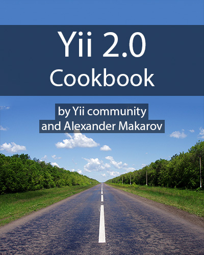

Yii 2.0 Cookbook
================

This repository hosts an OpenSource book full of tips and tricks about [Yii 2.0](http://www.yiiframework.com/) PHP framework.

[Here's the table of contents](https://github.com/samdark/yii2-cookbook/blob/master/book/README.md). We also have a [rendered version at readthedocs](https://yii2-cookbook.readthedocs.org/README/).

The book is created [by Yii community](https://github.com/samdark/yii2-cookbook/graphs/contributors) and edited by Alexander Makarov ([@samdark](https://github.com/samdark)), a core team member of the framework.

Feel free to pull request your own writings. I'll review it, provide feedback and merge the best possible way.
