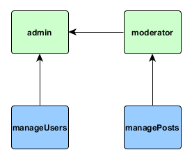

RBAC
====

RBAC which stands for Role Based Access Control is an access management system built into Yii. Despite [being described well in
official guide](http://www.yiiframework.com/doc-2.0/guide-security-authorization.html#rbac) there's no complete example on how
to use it. Let's fill the gap.

As an example we'll take article publishing system such as [YiiFeed](http://yiifeed.com/).

## Configuring RBAC component

Initial configuration of authentication manager component follows the same pattern as
[any other component configuration](http://www.yiiframework.com/doc-2.0/guide-structure-application-components.html):
in the application config under `components` section we're adding section called `authManager` specifying a class
and options for the object created. There are two backends available for authentication manager: PHP files and database.
Both are using the same API so there's no difference besides how RBAC data is stored.

### PHP backend

In order to configure PHP backend add the following to your config file:

```php
return [
    // ...
    'components' => [
        // ...
        'authManager' => [
            'class' => 'yii\rbac\PhpManager',
        ],
    ],
    // ...
];
```

> Note: If you are using `yii2-basic-app` template, there is a `config/console.php` configuration file where the
  `authManager` needs to be declared additionally to `config/web.php`. In case of `yii2-advanced-app` the
  `authManager` should be declared only once in `common/config/main.php`.
  
By default PHP file backend stores RBAC data under `@app/rbac` directory. That means `rbac` directory should be
created directly in your application directory and web server process should have permissions to write files
into this directory.

### Database backend

Setting up database backend is a bit more complex. First of all, add the following to your config file:

```php
return [
    // ...
    'components' => [
        'authManager' => [
            'class' => 'yii\rbac\DbManager',
        ],
        // ...
    ],
];
```

> Note: If you are using `yii2-basic-app` template, there is a `config/console.php` configuration file where the
  `authManager` needs to be declared additionally to `config/web.php`. In case of `yii2-advanced-app` the
  `authManager` should be declared only once in `common/config/main.php`.
  
Make sure you have database configured for both web and console applications then open console and run migration that would
create all the tables necessary to store RBAC data:

```
yii migrate --migrationPath=@yii/rbac/migrations
```

## Planning roles and permissions hierarchy

As an example we've chosen a publishing application. There are three types of users:

- Regular users who are reading and suggesting articles. They can edit their own articles as well.
- Moderators who are editing, approving, deleting or denying articles. They have access to moderation queue.
- Administrators who can do everything moderator can plus view list of users and edit their profiles.

At this point it's good to get pen and paper or software like [yEd](https://www.yworks.com/products/yed)
and draw the hierarchy.

The first rule of successfully using RBAC is to use as simple hierarchy as possible. In our case what regular user can do
isn't really needed to be associated with any role since we can make it work by default. Editing, approving, deleting or denying articles could be expressed as "managing articles". Viewing list of users and editing their profiles could be expressed as
"managing users". This simplification leads us to the following hierarchy:



## Filling hierarchy

If your project uses database and you're already familiar with
[migrations](http://www.yiiframework.com/doc-2.0/guide-db-migrations.html) it's better to build our hierarchy in migration.

Open your console and type

```
./yii migrate/create rbac_init
```

That would create new migration class with `up()` method in which we'd build the hierarchy and `down()` in which we'll destroy it.

```php
use yii\db\Migration;

class m141204_121823_rbac_init extends Migration
{
    public function up()
    {
        $auth = Yii::$app->authManager;

        $manageArticles = $auth->createPermission('manageArticles');
        $manageArticles->description = 'Manage articles';
        $auth->add($manageArticles);

        $manageUsers = $auth->createPermission('manageUsers');
        $manageUsers->description = 'Manage users';
        $auth->add($manageUsers);

        $moderator = $auth->createRole('moderator');
        $moderator->description = 'Moderator';
        $auth->add($moderator);
        $auth->addChild($moderator, $manageArticles);

        $admin = $auth->createRole('admin');
        $admin->description = 'Administrator';
        $auth->add($admin);
        $auth->addChild($admin, $moderator);
        $auth->addChild($admin, $manageUsers);
    }

    public function down()
    {
        Yii::$app->authManager->removeAll();
    }
}
```

In the above `createPermission()` and `createRole()` are creating new hierarchy objects but not yet saving
them. In order to save them `add()` should be called. `addChild()` method is used to connect child object to
their parents. When called this method saves connections immediately.

> Note: It doesn't matter which backend you're using: PHP files or database. Authentication manager exposes exactly
  the same methods so hierarchy is built using exactly the same code.
  
In case your application isn't using database at all or you don't want to use migrations, you can do the same in a console
command. For basic project template that would be `commands\RbacController.php`:

```php
<?php
namespace app\commands;

use yii\console\Controller;

class RbacController extends Controller
{
    public function actionInit()
    {
        if (!$this->confirm("Are you sure? It will re-create permissions tree.")) {
            return self::EXIT_CODE_NORMAL;
        }

        $auth = Yii::$app->authManager;
        $auth->removeAll();
        
        $manageArticles = $auth->createPermission('manageArticles');
        $manageArticles->description = 'Manage articles';
        $auth->add($manageArticles);

        $manageUsers = $auth->createPermission('manageUsers');
        $manageUsers->description = 'Manage users';
        $auth->add($manageUsers);

        $moderator = $auth->createRole('moderator');
        $moderator->description = 'Moderator';
        $auth->add($moderator);
        $auth->addChild($moderator, $manageArticles);

        $admin = $auth->createRole('admin');
        $admin->description = 'Administrator';
        $auth->add($admin);
        $auth->addChild($admin, $moderator);
        $auth->addChild($admin, $manageUsers);
    }
}
```

The command above could be called as `./yii rbac/init`.

## Assigning role to user

Since our default user doesn't have any role we don't need to worry about assigning it.
User role management could be implemented either in admin panel or in console. Since our admins are
cool guys, we'll create console contoller `commands\RbacController.php`:

```php
<?php
namespace app\commands;

use yii\console\Controller;

class RbacController extends Controller
{
    public function actionAssign($role, $username)
    {
        $user = User::find()->where(['username' => $username])->one();
        if (!$user) {
            throw new InvalidParamException("There is no user \"$username\".");
        }

        $auth = Yii::$app->authManager;
        $role = $auth->getRole($role);
        if (!$role) {
            throw new InvalidParamException("There is no role \"$role\".");
        }

        $auth->assign($role, $user->id);
    }
}
```

In the code above we're finding a user by username specified. Then getting role object by its name and assigning role
to a user by ID. Again, it doesn't matter if PHP backend or database backend is used. It would look exactly the same.

Also it would be exactly the same assignment in case of implementing admin UI or in case when you need role right away
and assigning it right after user is successfully singed up.

Sign up three new users and assign two of them `admin` and `moderator` roles respectively:

```php
./yii rbac/assign admin qiang
./yii rbac/assign moderator alex
```

## Checking access

Now we have RBAC in place and three users: regular user, moderator and admin. Let's start using what we've created.

### Access filter

The very basic access checks could be done via access control filter which is
[covered well in the official guide](http://www.yiiframework.com/doc-2.0/guide-security-authorization.html#access-control-filter):

```php
namespace app\controllers;

use yii\web\Controller;
use yii\filters\AccessControl;

class ArticleController extends Controller
{
    public function behaviors()
    {
        return [
            'access' => [
                'class' => AccessControl::className(),
                'only' => ['suggest', 'queue', 'delete', 'update'], //only be applied to
                'rules' => [
                    [
                        'allow' => true,
                        'actions' => ['suggest', 'update'],
                        'roles' => ['@'],
                    ],
                    [
                        'allow' => true,
                        'actions' => ['queue', 'delete'],
                        'roles' => ['manageArticles'],
                    ],
                ],
            ],
            'verbs' => [
                'class' => VerbFilter::className(),
                'actions' => [
                    'delete' => ['post'],
                ],
            ],
        ];
    }
    
    // ...
```

We're allowing any authenticated user to suggest articles. Same applied to editing articles (it's explained in the next
section). Viewing moderation queue and deleting articles are available only to roles which have `manageArticles`
permission. In our case it's both `admin` and `moderator` since `admin` inherits all `moderator` permissions.

Same simple checks via access control filter could be applied to `UserController` which handles admin actions regarding users.

### Doing manual checks

In some cases it's necessary to do manual checks. In our case it's checking if users is allowed to edit an article. We can't
do it via access control filter because we need to allow editing for regular users owning an article and moderators at the
same time:

```php
namespace app\controllers;

use app\models\Article;
use yii\web\Controller;
use yii\filters\AccessControl;

class ArticleController extends Controller
{
    // ...
    public function actionUpdate($id)
    {
        $model = $this->findModel($id);
        if (Yii::$app->user->id == $model->user_id || \Yii::$app->user->can('manageArticles')) {
            // ...
        } else {
            throw new ForbiddenHttpException('You are not alloed to edit this article.');
        }
    }
}
```

In the code above we're checking if current user is either article owner or is allowed to manage articles. If either one is true,
we're proceeding normally. Otherwise denying access.
